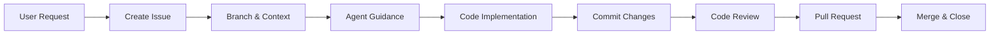

# CLAUDE.md

## 🎯 Project Overview

** Twitter/X SDKS**
Wrap all api for twitter/X.

**Tech Stack:**
Two languages type:

- RUST
- Typescript

## 📋 Core Workflow



### Golden Rules

1. **No Issue = No Code** - Every change starts with an issue
2. **Agents Guide, You Code** - Agents provide markdown guidance only
3. **Atomic Commits** - One commit = One logical change
4. **Track Everything** - Update context.md continuously

## 🔄 Development Process

### Step 1: Issue Creation

```bash
# Create issue first
gh issue create --title "[Feature] Add tweet scheduling"

# Branch naming: <type>/#<issue>-<description>
git checkout -b feature/#123-tweet-scheduling
```

### Step 2: Agent Consultation

```bash
# Get architectural guidance (markdown only)
consult @backend-developer "Design scheduling system for #123"
consult @frontend-developer "UI for tweet scheduler #123"
```

**⚠️ Agents provide guidance documents ONLY - no code!**

### Step 3: Implementation & Commits

```bash
# Implement based on guidance
# Commit with issue reference
git commit -m "feat(scheduler): add cron job support (#123)"
```

**Commit Format:**

```
<type>(<scope>): <message> (#<issue>)

- Detail 1
- Detail 2
```

Types: `feat` | `fix` | `docs` | `refactor` | `test` | `chore`

### Step 4: Review & PR

```bash
# Get review guidance
consult @code-reviewer "Review implementation for #123"

# Create PR
gh pr create --title "[#123] Tweet Scheduling Implementation"
```

## 🏗️ Project Structure

```
.claude/
├── task/
│   ├── context.md          # Current work status
│   └── issues/
│       └── issue-123.md    # Issue tracking
│
agents/
└── <agent-name>/
    └── outputs/
        └── issue-123-*.md  # Guidance documents
```

## 👥 Agent Roles

| Agent                   | Provides                          | Never Provides  |
| ----------------------- | --------------------------------- | --------------- |
| **rust-engineer**       | API design, architecture patterns | Rust code       |
| **typescript-engineer** | UI patterns, component structure  | Typescript code |
| **code-reviewer**       | Quality feedback, improvements    | Code fixes      |

## 📝 Context Management

Update `context.md` after:

- ✅ Creating issue
- ✅ Each commit
- ✅ Agent consultation
- ✅ PR creation

**Template:**

```markdown
## Active: Issue #123 - Tweet Scheduling

- Branch: feature/#123-tweet-scheduling
- Progress: 60%
- Next: Add UI components

## Completed

- [x] #122: Database setup
```

## 🚨 Workflow Violations

If workflow is violated, output:

```json
{
  "error": "workflow_violation",
  "type": "missing_issue_reference",
  "action": "Create issue before proceeding"
}
```

Common violations:

- ❌ Code without issue
- ❌ Missing agent consultation
- ❌ Agent providing code instead of guidance
- ❌ Context not updated

## ⚡ Quick Commands

```bash
# Full workflow
gh issue create                                  # 1. Create issue
git checkout -b feature/#123-description        # 2. Branch
consult @backend-developer "Design for #123"    # 3. Guidance
# ... implement ...                             # 4. Code
git commit -m "feat(api): add endpoint (#123)" # 5. Commit
consult @code-reviewer "Review #123"           # 6. Review
gh pr create                                    # 7. PR
```

## 📌 Remember

- **Agents = Consultants** (guidance only)
- **You = Developer** (write all code)
- **Every change needs an issue**
- **Document everything in context.md**
- **Commit atomically with issue refs**

---

_Workflow must be followed strictly. Any deviation triggers error response._
